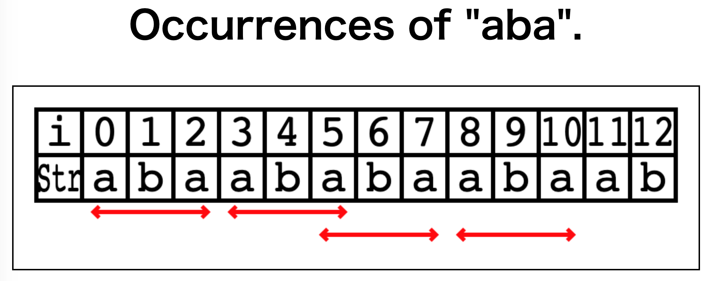

[](https://www.npmjs.com/package/visstr)

# VisStr

VisStr is a library to visualize a string and its properties such as repetitions, occurrences, and redundancies.

The following image visualizes all palindromes that occurs as substrings in "mississippi$".


See [demos](https://kg86.github.io/visstr/dist/vis_str_demo.html) and [API documents](https://kg86.github.io/visstr/docs/index.html).

## Compile

Run the following commands.

```bash
$ git clone https://github.com/kg86/visstr.git
$ cd visstr
$ npm install
$ npm run build
```

Libraries are output in `./lib` (UMD/CommonJS) and demo assets in `./dist`.

## Examples: Visualizing the substring occurrences

This is an example to visualize all the occurrences of `aba` in `abaababaabaab` using VisStr.

1. Add `<canvas>` element to the HTML which is a core of the visualizer.

```html
<canvas id="canvas" width="1000" height="240" style="border:1px solid #000000;">
</canvas>
```

2. Load the VisStr library `../lib/vis_str.umd.js`.
   Note that we have to use umd version for browser.

```html
<script type="text/javascript" src="../lib/vis_str.umd.js"></script>
```

3. Create a string and a range list representing the occurrences of `aba`, and specify the style of the range list (e.g., arrow, line, curve) and the color.

```javascript
const { VisStr } = window.visstr;
const canvas = document.querySelector("#canvas");
// create visstr object.
const vstr = new VisStr(canvas);
// input string
const s = "abaababaabaab";

// create occurrences of aba.
const occAba = [
  [0, 2],
  [3, 5],
  [5, 7],
  [8, 10],
];
// add line style and color.
const ranges = vstr.makeRanges(occAba, "arrow", "#ff0000");
// make group so that they are not overlap with each others.
const grouped = vstr.nonOverlapRanges(ranges);
vstr.draw(s, grouped);
```

The result is visualized as follows:



You can find the [source code](dist/vis_str_demo_occ.html), and the [demo page](https://kg86.github.io/visstr/dist/vis_str_demo_occ.html).
